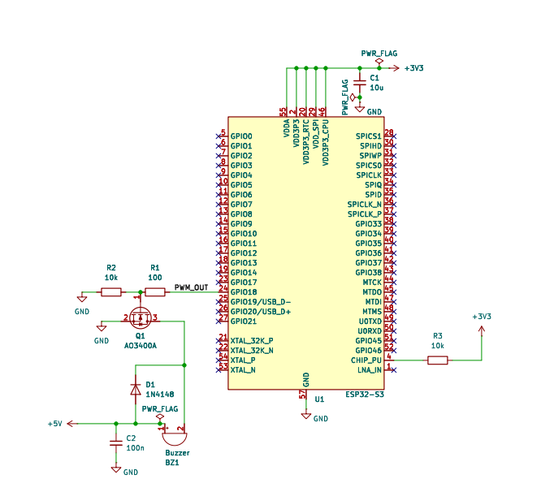

# Ultrasonic Pest Repellent System (Research & Prototype)

## Documentation

- [Technical Report](docs/technical_report.pdf)

## Experiments

- [Experiment Notes](experiments/experiment_notes.md)

- ## Hardware

The hardware design is available in the `/hardware` folder and includes:

- KiCad project files
- Full schematic (PDF)
- ESP32-S3 based control system

- ## Project Status

Research / Prototype stage  
Further experimental validation required

---

## Contact

Feel free to reach out for collaboration or discussion.
